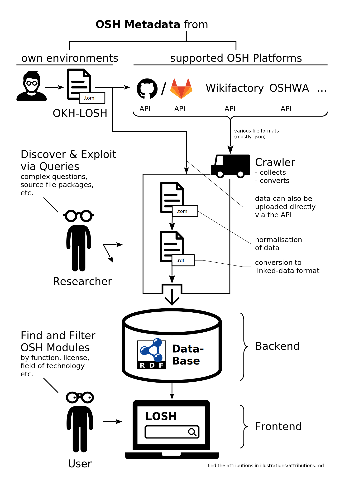

# OKH-LOSH

LOSH: **_A Library of Open Source Hardware - technical documentation in an open graph database._**

demonstrator will be available at [wikibase.oho.wiki](https://wikibase.oho.wiki/)

The work here is based on the [Open Know-How Specification v1.0.0](https://app.standardsrepo.com/MakerNetAlliance/OpenKnowHow/src/branch/master/1#75fb9df0-a7b3-427f-993a-b23fe1c81a58), specifically to make the OKHv1 specification applicable to linked open data and rework data fields after latest research results.\
However, lots of changes have been made so it's hard to still call this a fork.\
After validation this will be proposed to maintainers of the Open Know-How Specification as a new major version of the specification.

## Intro

### Who is doing this?

[OPENNEXT](https://opennext.eu/) is a collaboration
between 19 industry and academic partners
across Europe.
Funded by the [European Union](https://europa.eu/)'s
[Horizon 2020](https://ec.europa.eu/programmes/horizon2020/) programme,
this project seeks to enable small and medium enterprises (SMEs)
to work with consumers, makers, and other communities in rethinking
how products are designed and produced.
[Open source hardware](https://www.oshwa.org/definition/)
is a key enabler of this goal
where the design of a physical product is released with the freedoms
for anyone to study, modify, share, and redistribute copies.
These essential freedoms are based on those of [open source software](https://opensource.org/osd),
which is itself derived from [free software](https://www.gnu.org/philosophy/free-sw.en.html)
where the word free refers to freedom, *not* free-of-charge.
When put in practice,
these freedoms could potentially not only reduce proprietary vendor lock-in,
planned obsolescence, or waste but also stimulate novel –
even disruptive – business models.
The SME partners in OPENNEXT are experimenting
with producing open source hardware and even opening up the development process
to wider community participation.
They produce diverse products ranging from [desks](https://stykka.com/),
[cargo bike modules](http://www.xyzcargo.com/),
to a [digital scientific instrument platform](https://pslab.io/)
(and [more](https://opennext.eu/project-team/#sme)).

The work carried out in this repository is subject to WP3 of OPEN!NEXT
("Supporting production engineering with ICT infrastructure")
and lead by the [department of Information and Process Control
at the Fraunhofer Institute for Production Systems and Design Technology](https://www.ipk.fraunhofer.de/en/about-us/organization/virtual-product-creation.html).

### tl;dr

(semi-)automated structuring of OSH modules:
a demonstrator for an ICT infrastructure to facilitate design reuse

### long

Some very special advantages of open source technologies only come to effect
when we start to connect them.
Especially hardware.

Through open source hardware (OSH) we can share design files,
assembly instructions, operation and maintenance guides,
recycling guidelines, structural analyses, calculations & simulations etc. –
and attached to OSH modules they become as modular as the hardware itself.

Just as developer can re-use design files to avoid reinventing the wheel,
they can re-use documentation of any kind.
Applied to calculations, developer could access the cumulated experience
of countless OSH modules that have been realised and tested in practise
and hence assess e.g. boundary conditions
or the dimension of certain components much faster
and on a much more reliable basis.
What once was the undisclosed know-how of large,
specialised enterprises can become a public pool of knowledge.

**We want to organise open source hardware in a graph database.**

There's a [longlist](Wikibase_Qs.md) of interesting information
that could be derived from such a database
(also regarding compatibility between OSH modules).

For version 1.0 we will focus on hardware only.
Ideas for later, compatible databases are:

- standard parts
- calculation tables & machine-readable standards (e.g. regarding welding parameters)
- manufacturers (to match e.g. design requirements
  with suitable manufacturing lines nearby)
- funding opportunities (to match e.g. funding requirements with OSH projects)

Standards are the backbone for this approach.

### short & crisp

We are aiming to build the (real) Internet of Things – the Internet of Open Hardware.

## Scope

### tl;dr Q&A

**What is the domain that the ontology will cover?**

Now: Open Source Hardware\
In the future: standard parts, software, manufacturers, tools, funding opportunities,…

**Who's the enduser you have in mind?**

1. developers\
  the whole thing here is first and foremost about **design reuse**
2. manufacturers / service providers\
  find OSH ready for decentralised (mass) production, maintenance and service provision

**What's the problem this thing is solving? Or rather, how does this 'tool' look like?**

1. It's a powerful filter for OSH. Find what you acutally need.
2. It's a knowledge base capable to
  1. answer complex questions like
    "What kind of power contoller is commonly used for this sort of hardware?";
  2. cross-link information
    (e.g. ongoing research with OSH designs (e.g. in case of COVID-19)).

**What are use cases of the ontology?**

- find the OSH that solves your problem
  (→ **linking OSH modules with functional categories**)
  - filter for license, certificate, functional categories,
    file formats…
  - e.g. search for corona-related projects
- …or fits into _your_ OSH
  (→ **linking OSH modules, facilitate design reuse**)
- map of usage, hence compatibility between OSH Modules
  (_this_ module is also included _that_ assembly
  and thus seemingly works in this environment)
  - this is BTW not limited to OSH;
    proprietary hardware can be linked as well;
    this may help reducing (electronic) waste or finding appropriate wear parts
- provide portable metadata: OSH can be published on various platforms
- facilitate packaging: standardised metadata shall enable a "download button" for:
  - production files (export only)
  - developer files (sources only)
  - complete clone (export + sources)
- custom/future use cases are enabled by linking to other data/knowledge bases
  such as
  - Wikidata
  - Journal of Open Hardware

**Who will use and maintain the ontology?**

1. all the awesome communities that provide the ontology modules we are using;
  namingly everything that Wikidata uses
2. us; the few things built on top of the ontologies in 1. are to be maintained by us

## Technical details

**How does the dataflow generally work?**

- technical details of the wikibase instance: <https://gitlab.opensourceecology.de/verein/koordination/it/tickets/-/issues/43>
- open standards used:
  - The [DIN SPEC 3105](https://gitlab.com/OSEGermany/OHS)
    (to be published under CC BY-SA 4.0 in June 2020)
    and the [OH-TsDC](https://gitlab.com/OSEGermany/oh-tsdc) define clear,
    enforceable criteria for technical documentation of OSH
    (+ a community-based assessment procedure in order to prove that)
  - The [Open Know-How Metadata Standard](https://app.standardsrepo.com/MakerNetAlliance/OpenKnowHow/src/branch/master/1)
    gives a first approach to organise OSH through reasonable metadata.

### Related work

- the importer to push the ontology from any git-based instance to any Wikibase instance\
  <https://github.com/hoijui/LOSH-tools> (by hoijui, IPK)
- the reworked API to improve reconciliation tasks\
  <https://github.com/wmde/WikibaseReconcileEdit> (by addshore, WMDE)
- the crawler that collects all the data\
  <https://github.com/OPEN-NEXT/LOSH-krawler> (by ahane, konek.to)

## Want to contribute \[?\]

'til we have a proper conribution guide,
just join our group on [telegram](https://t.me/joinchat/FiYCVhD-NPfpMr5PnZaiNQ) :)

## Why are we doing this?

I feel this quote gives a neat, compact explanation:

"Human history, closely explored,
boils down to the history of invention of better tools."\
– Ernst Knapp: cultural geographer (1808-1896)

