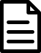
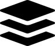
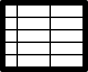
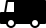

# Attributions

|IMAGE|NAME & SOURCE|AUTHOR|LICENSE|
|---|---|---|---|---|
||[document](https://thenounproject.com/search/?q=1830658&i=1830658)|arjuazka|[CC BY 3.0](https://creativecommons.org/licenses/by/3.0/us/legalcode)|
||[platform](https://thenounproject.com/search/?q=3097564&i=3097564)|Adrien Coquet|[CC BY 3.0](https://creativecommons.org/licenses/by/3.0/us/legalcode)|
||[scientist](https://thenounproject.com/search/?q=770801&i=770801)|Gregor Cresnar|[CC BY 3.0](https://creativecommons.org/licenses/by/3.0/us/legalcode)|
||[spreadsheet](https://thenounproject.com/search/?q=45392&i=45392)|useiconic.com|[CC BY 3.0](https://creativecommons.org/licenses/by/3.0/us/legalcode)|
||[transporter](https://thenounproject.com/search/?q=745250&i=745250)|Ralf Schmitzer|[CC BY 3.0](https://creativecommons.org/licenses/by/3.0/us/legalcode)|
||[Wikibase logo](https://en.wikipedia.org/wiki/Wikibase#/media/File:Wikibase_logo.svg)|H. Snater|[GPLv3](https://www.gnu.org/licenses/gpl-3.0.en.html)|
